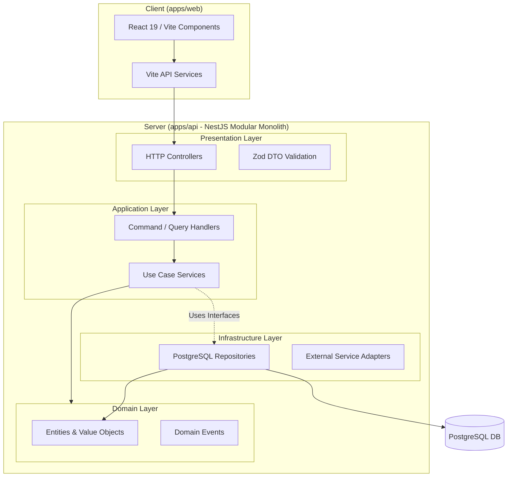

# Sentinel ERP — Full-Suite Enterprise Resource Planning

[](#)
[](#)
[](#)
[](#)
[](#)

Sentinel ERP is a modern, modular, and AI-native enterprise resource planning system designed to unify operations, automate workflows, and deliver real-time predictive business intelligence for organizations scaling from 50 to 50,000 employees.

---

> [!IMPORTANT]
> ### 🌐 Live Web Application Instance
> **Deployment Hosting URL:** [https://sentinel-erp-auth-92831.web.app](https://sentinel-erp-auth-92831.web.app)
> 
> Explore the live deployment on **Firebase Hosting** to test the Executive Command Center, AI Copilot chat system, and cross-functional workflow boards.

---

## 🏗️ Architecture & Flow Overview

Sentinel ERP is structured as a **Modular Monolith** designed for high maintainability, strict layer separation, and evolutionary migration path toward microservices.

### Layer Dependency Rules
The system enforces a strict one-way dependency rule: **Presentation** depends on **Application**, which utilizes interfaces to abstract **Infrastructure**, keeping the **Domain** core pure.



---

## 📦 System Modules

Sentinel ERP is divided into highly decoupled domains that communicate via domain events or public API contracts:

| Module | Core Capabilities | Highlights |
| :--- | :--- | :--- |
| **HRMS** | Employee Directory, Payroll, Attendance, Performance | Automated payroll runs & direct bank integrations |
| **CRM** | Customer Pipelines, Deals, Accounts, Sales Automation | Live contact updates & leads lifecycle metrics |
| **Finance** | General Ledger, Invoices, Tax, Cash Flow | Multi-currency transactions & balance sheets |
| **Inventory** | SKU Tracking, Multi-warehouse, Stock alerts | Low-stock triggers & auto-replenishment loops |
| **Procurement** | Purchase Orders, Vendor portal, SLA tracking | Standardized RFQ processes & SLA audits |
| **Workflows** | Interactive Workflow Builder, Escalations | If/Else branching & cross-department routing |
| **AI Analytics** | Natural Language Query (Copilot), Forecasting | ML-powered demand forecasts & anomaly alerts |

---

## 🛠️ Technology Stack

### Frontend (`apps/web`)
- **Core Library:** React 19 (Functional Components, Hooks)
- **Bundler & Tooling:** Vite 8 & TypeScript
- **Styling:** Tailwind CSS 4 & Vanilla CSS variables for dark/glassmorphic custom designs
- **Animations:** Framer Motion (micro-animations) & Three.js (Magic Rings ambient effects)
- **Deployment:** Firebase Hosting & Firebase Authentication

### Backend (`apps/api`)
- **Framework:** NestJS (Node.js) with modular routing
- **ORM / Querying:** TypeScript ORM / Data Connect relational structures
- **Validation:** Zod schemas
- **Compilation:** TypeScript Compiler (`tsc`) & TSX watch

---

## 🚀 Getting Started

### 📋 Prerequisites
- **Node.js:** `>=20.0.0`
- **NPM:** `>=10.0.0`

### 💻 Local Development Setup

1. **Clone the repository:**
   ```bash
   git clone https://github.com/jeevansai-hub/Sentinal-ERP.git
   cd Sentinal-ERP
   ```

2. **Install all workspace dependencies:**
   ```bash
   npm install
   ```

3. **Set up Environment Variables:**
   Create a `.env` file at the root using the template inside `configs/environments/.env.development.example`.

4. **Launch the development server:**
   ```bash
   npm run dev
   ```
   *This starts both the NestJS API server (`http://localhost:3000`) and the React Client app (`http://localhost:5173`) concurrently.*

### 🛠️ Production Build
To run static typechecks and build the production-ready code blocks:
```bash
npm run build
```
- Frontend bundles compile into `apps/web/dist`.
- Backend compiles into pure JS output inside `apps/api/dist`.

---

## 🌩️ Deployment to Firebase Hosting

To deploy updates to the frontend web application:
```bash
# Authenticate to Firebase CLI (if not already logged in)
npx firebase-tools login

# Build the project assets
npm run build:web

# Deploy build files to Firebase Hosting
npx firebase-tools deploy --only hosting
```