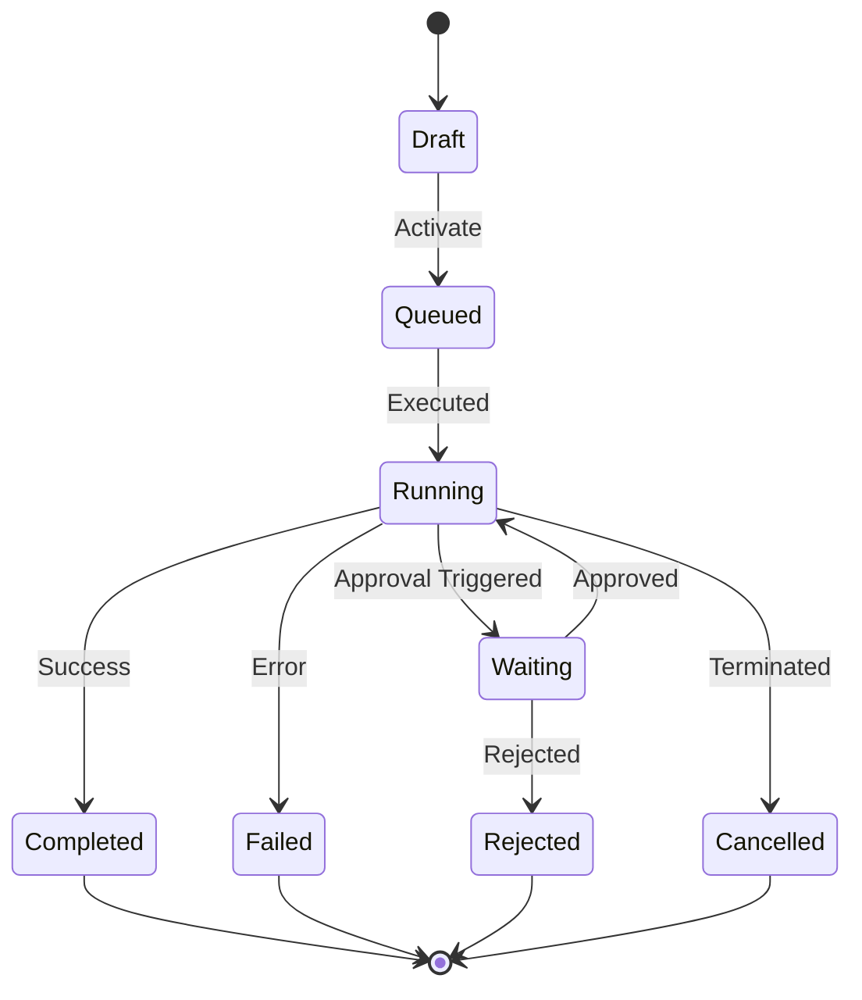

# n8n AI Agent Workflows Implementation Blueprint

This blueprint outlines the production-ready n8n AI Agent and Workflow architecture extracted from the Sentinel ERP project codebase. It maps the actual REST API interfaces, agents registry, and modular monolithic architecture of Sentinel ERP directly into deployable n8n nodes and logic gates.

---

## 1. Agent Catalog

Exposed via `/agents/registry`, the platform contains three core cognitive agents.

### Agent 1: Lead Qualifier Agent
* **Business Purpose:** Triages incoming customer leads and evaluates interest quality based on sentiment and firmographics.
* **Trigger Events:** `Event: Lead Created` (via `/webhooks/crm/lead-created`).
* **Inputs:** CRM contact form schema (`email`, `companySize`, `requestMessage`).
* **Outputs:** Lead categorization score, confidence score (`number`), assignment owner.
* **Decision Logic:** Matches firmographics against target profile (e.g. `companySize > 50`) and evaluates requests using Sentiment Analysis.
* **Actions:** Calls `/crm/deals` to create a qualified deal or tags CRM logs for nurture routing.
* **Tools Used:** `CRM Deal API Tool`, `Sentiment Analysis Model Tool`.
* **Memory Requirements:** Ephemeral Chat Window Memory (10 messages buffer).
* **Approval Requirements:** None (fully automated qualification).
* **Escalation Logic:** Route to manual Sales Inbox if confidence score falls below `85%`.
* **Dependencies:** CRM database schema access.
* **Expected Outcomes:** Automated lead categorization with < 2% human touchpoint.

### Agent 2: Sales Closer Agent
* **Business Purpose:** Generates custom contract drafts and suggests discount boundaries during active negotiations.
* **Trigger Events:** `Event: Deal Negotiating` (via `/crm/deals` updates).
* **Inputs:** Deal details (`dealValue`, `clientRequirements`, `standardTerms`).
* **Outputs:** Contract draft document PDF, discount recommendation.
* **Decision Logic:** Strictly checks margin boundaries:
  - If requested discount $\le 15\%$: Auto-approves and drafts contract.
  - If requested discount $> 15\%$: Initiates approval workflow.
* **Actions:** Updates `/crm/deals` stage and dispatches Slack alert to Sales Rep.
* **Tools Used:** `DocGen HTML-to-PDF Tool`, `CRM Deals Updater Tool`.
* **Memory Requirements:** Long-Term Pinecone memory holding historical contract structures.
* **Approval Requirements:** Finance approval required for discounts between $15\%$ and $25\%$.
* **Escalation Logic:** Escalates automatically to VP of Sales if discount exceeds $25\%$.
* **Dependencies:** CRM and Finance API modules.

### Agent 3: Finance Auditor Agent
* **Business Purpose:** Audits ledgers against invoices and verifies payment reconciliation compliance.
* **Trigger Events:** `Event: Invoice Overdue` or `Event: Invoice Created`.
* **Inputs:** Ledger records, invoices transaction data DTO.
* **Outputs:** Match confirmation (`Matched` or `Discrepancy`), risk flags, error reports.
* **Decision Logic:** Double-entry ledger comparison:
  - Match invoice line sums with ledger ledger entries.
  - Flag if variance $> 0.01\%$.
* **Actions:** Marks `/finance/invoices` audit status and creates discrepancies alerts.
* **Tools Used:** `Ledgers API Tool`, `Invoices API Tool`.
* **Memory Requirements:** Conversation memory holding auditing runs history.
* **Approval Requirements:** CFO manual approval required for ledger corrections $> ₹5,00,000$.
* **Escalation Logic:** Escalates if ledger discrepancy remains unresolved $> 48$ hours.
* **Dependencies:** Finance module API endpoints (`/finance/ledgers`, `/finance/invoices`).

---

## 2. Workflow Catalog

Based on the `/workflows/definitions` endpoints mapping:

### Workflow 1: Invoice Audit Approval (`wf-201`)
* **Business Goal:** Automated audit and manual escalation routing for overdue invoices.
* **Trigger:** Event-based Webhook (`Event: Invoice Overdue`).
* **Input Data:** Overdue Invoice object.
* **Validation Rules:** Valid Invoice UUID, non-zero amount, ledger reference present.
* **Conditions:** Amount-based split check.
* **Decision Nodes:** 
  - `IF: Invoice Amount > ₹5,00,000` $\rightarrow$ Route to CFO.
  - `IF: Ledger Match Fails` $\rightarrow$ Route to Finance discrepancy queue.
* **Actions:** Updates invoice audit logs, sets status to `Audited`.
* **External Calls:** HTTP GET to `/finance/ledgers` and `/finance/invoices`.
* **Notifications:** Slack alert to Finance team, email billing update to client.
* **Human Approvals:** Wait for CFO approval webhook on large amounts.
* **Completion Rules:** State update committed to database.
* **Failure Rules:** Log execution error, alert DevOps on Slack, set state to `Audit_Failed`.
* **Retry Logic:** HTTP calls retried up to 3 times (exponential backoff).
* **Audit Requirements:** Write record to `/agents/decisions` log registry.

### Workflow 2: PO Auto-Provisioning (`wf-202`)
* **Business Goal:** Auto-draft Purchase Orders (POs) when stock thresholds breach reorder bounds.
* **Trigger:** Threshold-based stock alert (breached stock level event).
* **Input Data:** Inventory item metadata, stock count, vendor ID.
* **Validation Rules:** Valid Item UUID, count $\le$ threshold.
* **Conditions:** Preferred vendor exists with active contract pricing.
* **Decision Nodes:** 
  - `IF: Preferred Vendor Contract Active` $\rightarrow$ Draft PO.
  - `IF: No active contract` $\rightarrow$ Create RFQ draft.
* **Actions:** Calls `/procurement/rfqs` to draft RFQ or `/procurement/vendors` to compile details.
* **Notifications:** Send email notification to procurement lead.
* **Human Approvals:** PO values $> ₹1,00,000$ require manager approval before release.
* **Failure Rules:** Flag bottleneck to Slack if approval is pending $> 48$ hours.

---

## 3. Webhook Catalog

All webhooks accept `application/json` payloads and require a SHA-256 HMAC header verification.

| Webhook Name | Endpoint URL | Method | Auth | Associated Agent |
| :--- | :--- | :--- | :--- | :--- |
| **CRM Lead Ingest** | `https://n8n.domain.com/webhook/crm/lead-created` | `POST` | Signature | Lead Qualifier Agent |
| **Invoice Overdue** | `https://n8n.domain.com/webhook/finance/invoice-overdue` | `POST` | JWT Bearer | Finance Auditor Agent |
| **Stock Alert Ingest** | `https://n8n.domain.com/webhook/inventory/stock-alert` | `POST` | Bearer Token| Finance Auditor Agent |

### Request Schema (`CRM Lead Ingest`)
```json
{
  "lead_id": "uuid",
  "email": "string",
  "company_size": "integer",
  "request_message": "string"
}
```

---

## 4. WebSocket Catalog

Provides real-time interactive sockets for the front-end dashboard and the AI Copilot.

* **Channel Name:** `/ws/copilot`
  - **Purpose:** Handles stream communication between client UI and AI Agent.
  - **Publish Events:** `chat:message` (payload: `{ text: string, session_id: string }`).
  - **Subscribe Events:** `chat:reply` (payload: `{ text: string, stream_chunk: boolean }`).
* **Channel Name:** `/ws/alerts`
  - **Purpose:** Dispatches real-time audit discrepancy alerts.
  - **Publish Events:** `alert:discrepancy` (payload: `{ alertId: string, module: string, text: string }`).
  - **Consumers:** Front-end Command Center dashboard.

---

## 5. Tool Catalog

These tools run as HTTP Request Nodes within the n8n AI Agent Executor Node.

### Tool 1: CRM Deals Reader
* **Purpose:** Reads sales deals records.
* **Endpoint:** `GET http://api:3000/crm/deals`
* **Authentication:** Bearer Token.
* **Output Schema:** `{ deals: Array<{ id: string, name: string, stage: string, value: number }> }`.
* **Access Rules:** Allowed for: Lead Qualifier, Sales Closer.

### Tool 2: Ledger Auditor
* **Purpose:** Queries general ledgers for audit matching.
* **Endpoint:** `GET http://api:3000/finance/ledgers`
* **Authentication:** Bearer Token.
* **Output Schema:** `{ ledgers: Array<{ id: string, transactionId: string, amount: number, accountCode: string }> }`.
* **Access Rules:** Allowed for: Finance Auditor Agent.

### Tool 3: RFQ Creator
* **Purpose:** Creates a draft Request for Quote (RFQ) in procurement.
* **Endpoint:** `POST http://api:3000/procurement/rfqs`
* **Authentication:** Bearer Token.
* **Input Schema:** `{ itemId: string, targetQuantity: number }`.
* **Access Rules:** Allowed for: Finance Auditor Agent (escalating to procurement).

---

## 6. Memory Architecture

n8n uses the standard LangChain components built into n8n AI nodes.

* **Short-Term Memory:** 
  - **Storage:** Redis (Shared instance) via n8n's **Window Buffer Memory** node.
  - **Expiry:** 1 hour inactivity.
* **Long-Term / Knowledge Memory:**
  - **Storage:** PostgreSQL vector schema (`vector.embeddings`) via pgvector.
  - **Retrieval:** Cosine similarity query of embedded project records.
* **Update Logic:** Background sync scripts run at `00:00` daily, indexing new `/finance/ledgers` and `/crm/deals` updates.

---

## 7. Agent Communication Matrix

Defines how agent swarms coordinate using **n8n Multi-Agent** routers:

```
                  ┌──────────────────────┐
                  │   Coordinator Agent  │
                  └──────────┬───────────┘
            ┌────────────────┴────────────────┐
            ▼                                 ▼
   ┌──────────────────┐              ┌──────────────────┐
   │Lead Qualifier Ag.│              │Sales Closer Agent│
   └──────────────────┘              └──────────────────┘
```

| Sender Agent | Receiver Agent | Message Type | Trigger Condition |
| :--- | :--- | :--- | :--- |
| **Coordinator Agent** | **Lead Qualifier Agent** | Query Task | New lead ingested |
| **Lead Qualifier Agent** | **Sales Closer Agent** | Event Transfer | Lead passes target metrics |
| **Sales Closer Agent** | **Coordinator Agent** | Escalation Alert | Deal discount requested $> 25\%$ |

---

## 8. Event Catalog

Core business events mapped to triggers:

1. **`Event: Lead Created`**
   - Source: CRM Webform
   - Payload: `{ leadId: UUID, clientName: string, requestMessage: string }`
2. **`Event: Invoice Overdue`**
   - Source: Finance Scheduler
   - Payload: `{ invoiceId: UUID, daysOverdue: number, ledgerId: UUID }`
3. **`Threshold: Stock Reorder`**
   - Source: Inventory Monitor
   - Payload: `{ itemId: UUID, currentStock: number, reorderThreshold: number }`

---

## 9. Approval Matrix

Authentication thresholds for manual verification routing:

| Operation | Trigger Condition | Approver Role | SLA Escalation Time |
| :--- | :--- | :--- | :--- |
| **Contract Discount** | Discount requested $> 15\%$ | Finance Manager | 24 Hours |
| **Contract Special Terms**| Discount requested $> 25\%$ | VP of Sales | 12 Hours |
| **Ledger Discrepancy Correction** | Ledger adjustment request $> ₹5,00,000$ | CFO | 48 Hours |

---

## 10. Complete n8n Node Mapping

### Workflow: Invoice Audit Approval (`wf-201`)

```
 [Webhook Trigger] ──► [HTTP: Get Invoice] ──► [HTTP: Get Ledgers] ──► [Code: Audit Match]
                                                                              │
                                                                       (Amount Check)
                                                                              ├─► [IF: > ₹5,00,000] ──► [CFO Approval Loop]
                                                                              │
                                                                              └─► [Slack Notification]
```

1. **Webhook Node:**
   - Path: `/webhook/finance/invoice-overdue`
   - Authentication: Signature verification.
2. **HTTP Request Node (`Get Invoice`):**
   - URL: `http://api:3000/finance/invoices`
   - Query: `invoiceId = {{$json.invoice_id}}`
3. **HTTP Request Node (`Get Ledgers`):**
   - URL: `http://api:3000/finance/ledgers`
4. **Code Node (`Audit Match`):**
   - Runs validation script matching invoice total with corresponding ledger details.
5. **IF Node (`Amount Check`):**
   - Checks if Invoice Amount is $> 500,000$.
6. **Wait Node (`CFO Approval Loop`):**
   - Halts execution, generates a unique confirmation token, and sends an approval email to the CFO.
7. **HTTP Request Node (`Update Invoice`):**
   - Submits audited confirmation updates to `/finance/invoices`.

---

## 11. Environment Variables

Variables required in n8n execution space:

* `N8N_ENCRYPTION_KEY`: Encryption secret for nodes credentials.
* `ERP_API_BASE_URL`: `http://api:3000` (internal service resolver).
* `FIREBASE_PROJECT_ID`: `sentinel-erp-auth-92831` (auth verification).
* `REDIS_HOST`: Redis instance for ephemeral Agent memory.
* `DATABASE_URL`: Postgres DB connection URI.

---

## 12. Deployment Requirements

* **Environment:** Docker Compose monorepo network context.
* **Network Rules:** n8n must run in the same virtual network as the NestJS backend (`apps/api`) to directly resolve services on `http://api:3000`.
* **Resources:** Minimum 2GB RAM allocated for n8n container, 0.5 CPU core.

---

## 13. Monitoring Requirements

* **Failed executions alerts:** Route to Slack channel `#ops-alerts` via n8n **Error Trigger** node.
* **Execution Metrics:** Read database execution logs using `/workflows/metrics` to flag bottlenecks.

---

## 14. Security Requirements

1. **HTTPS Enforced:** Public webhooks must be routed through an SSL reverse proxy (Nginx / Let's Encrypt).
2. **JWT Authorization:** Bearer header verified using Sentinel ERP token secret.
3. **Audit Trail:** Every decision made by AI Agent nodes must be pushed back to the `/agents/decisions` logging endpoint.

---

## 15. Production Readiness Checklist

- [ ] Webhook signatures (HMAC SHA-256) enabled.
- [ ] Redis caching enabled for agent chat history memory.
- [ ] Error trigger workflows active and routed to Slack.
- [ ] Database backup triggers active prior to workflow operations.
- [ ] SSL certificates verified and auto-renew config complete.
- [ ] Maximum execution limits and timeout thresholds defined (default: 300 seconds).

---

## 16. Consolidated Project AI Agents Summary

Below is the consolidated summary of all AI Agents registered in the Sentinel ERP modules (`/agents/registry`) for direct integration into n8n nodes:

1. **Lead Qualifier Agent** (`agent-1`):
   - **Cognitive Type:** Task-Based Agent
   - **Owner Department:** Sales
   - **Health Status:** Nominal
   - **Assigned Skills:** `lead-sorting`, `sentiment-analysis`

2. **Sales Closer Agent** (`agent-2`):
   - **Cognitive Type:** Reasoning-Based Agent
   - **Owner Department:** Sales
   - **Health Status:** Nominal
   - **Assigned Skills:** `negotiation`, `contract-drafting`

3. **Finance Auditor Agent** (`agent-3`):
   - **Cognitive Type:** Analytical-Based Agent
   - **Owner Department:** Finance
   - **Health Status:** Nominal
   - **Assigned Skills:** `ledger-matching`, `disbursement-verification`

---

## 17. Advanced AI Agent Runtime Engine

This section specifies the execution engine orchestration configuration for n8n AI Agent nodes.

```yaml
agent_runtime:
  planner:
    model: gemini-2.5-flash
    temperature: 0.1
    reasoning_steps_limit: 8
  executor:
    execution_timeout_ms: 120000
    concurrency_limit: 4
  reviewer:
    validation_mode: strict
    fallback_agent: Coordinator Agent
  memory_manager:
    short_term_store: redis
    long_term_store: postgres-pgvector
  tool_router:
    routing_type: dynamic
    match_strategy: semantic
  context_builder:
    max_history_tokens: 4096
    include_system_telemetry: true
  response_generator:
    format: JSON_SCHEMA
    fallback_content: "Failed to compile response due to constraints breach."
```

### Core Execution Parameters
* **System Prompt:** "You are Sentinel AI Agent. You execute commands using strict tool registries. Maintain double-entry integrity, verify role scopes, and log decisions."
* **Goals:** Optimize resource allocation, minimize latency, verify compliance.
* **Constraints:** Never modify database schema; restrict transaction mutations above ₹1,00,000 without manager sign-off.
* **Allowed Tools:** Defined dynamically per agent registry scope (see Section 18).
* **Forbidden Actions:** No raw SQL insertions, direct cross-schema mutations, or raw credentials exposure.
* **Reasoning Strategy:** ReAct (Reasoning and Action) Loop with output schema verification.
* **Fallback Strategy:** Graceful degradation (delegation to Coordinator Agent).
* **Retry Strategy:** Exponential backoff (initial wait 2s, multiplier 2, max 3 retries).
* **Cost Limits:** Max $0.05 per individual execution trace.
* **Token Limits:** Max 8,192 input tokens, 2,048 output tokens.

---

## 18. Agent Registry Schema

```yaml
agent_registry_schema:
  properties:
    agent_id:
      type: string
      format: uuid
    agent_name:
      type: string
    agent_version:
      type: string
      default: "1.0.0"
    agent_type:
      type: string
      enum: ["task", "reasoning", "analytical", "coordinator"]
    department:
      type: string
    owner:
      type: string
    status:
      type: string
      enum: ["Nominal", "Degraded", "Offline"]
    priority:
      type: string
      enum: ["Critical", "High", "Standard"]
    permissions:
      type: array
      items:
        type: string
    allowed_tools:
      type: array
      items:
        type: string
    memory_profile:
      type: object
      properties:
        window_size:
          type: integer
        vector_store_ref:
          type: string
    knowledge_sources:
      type: array
      items:
        type: string
    model:
      type: string
    temperature:
      type: number
    max_tokens:
      type: integer
    cost_limit:
      type: number
```

---

## 19. Multi-Agent Orchestration Engine

Sentinel ERP utilizes a collaborative Multi-Agent mesh to coordinate complex cross-functional workflows.

### Orchestration Matrix

```
                      ┌───────────────────┐
                      │   Planner Agent   │
                      └─────────┬─────────┘
                                ▼
                    ┌───────────────────────┐
                    │   Coordinator Agent   │
                    └───────────┬───────────┘
         ┌──────────────────────┼──────────────────────┐
         ▼                      ▼                      ▼
┌──────────────────┐  ┌──────────────────┐  ┌──────────────────┐
│  Research Agent  │  │ Knowledge Agent  │  │ Execution Agent  │
└──────────────────┘  └──────────────────┘  └──────────────────┘
         │                      │                      │
         └──────────────────────┼──────────────────────┘
                                ▼
                     ┌─────────────────────┐
                     │    Review Agent     │
                     └──────────┬──────────┘
                                ▼
                     ┌─────────────────────┐
                     │     Audit Agent     │
                     └──────────┬──────────┘
                                ▼
                     ┌─────────────────────┐
                     │   Approval Agent    │
                     └──────────┬──────────┘
                                ▼
         ┌──────────────────────┴──────────────────────┐
         ▼                                             ▼
┌──────────────────┐                          ┌──────────────────┐
│Notification Agent│                          │ Monitoring Agent │
└──────────────────┘                          └──────────────────┘
```

| Agent Name | Interaction Role | Inputs | Target Handover |
| :--- | :--- | :--- | :--- |
| **Planner Agent** | Parses complex multi-step prompts | User instructions | Coordinator Agent (DAG plan) |
| **Coordinator Agent** | Coordinates task execution DAG | DAG plan | Execution Agent / Research Agent |
| **Research Agent** | Gathers external metrics | Webhooks, market indices | Analysis Agent |
| **Knowledge Agent** | Queries SOP database | Document chunks | Execution Agent (context injection)|
| **Execution Agent** | Fires transaction APIs | ERP schemas payload | Review Agent |
| **Review Agent** | Validates schema & constraints | Execution response | Audit Agent |
| **Audit Agent** | Writes ledger and security trails | State mutation metrics | Approval Agent (if required) |
| **Approval Agent** | Holds loop for human interaction | Review logs, SLA timer | Notification Agent |
| **Notification Agent**| Broadcasts alerts to channels | Payload, recipient config | Monitoring Agent / Client socket |
| **Monitoring Agent** | Measures performance & errors | Execution duration, tokens | Security Agent |
| **Security Agent** | Validates against prompt injection| raw prompt text | Planner Agent |

---

## 20. Event Bus Architecture

For high-throughput asynchronous communication, the monorepo utilizes **Redis Streams** for local routing, with a fallback hook for **RabbitMQ**.

### Event Schema
```yaml
event_message:
  properties:
    event_id:
      type: string
      format: uuid
    event_type:
      type: string
    event_source:
      type: string
    event_target:
      type: string
    event_priority:
      type: string
      enum: ["CRITICAL", "HIGH", "NORMAL"]
    event_status:
      type: string
      enum: ["QUEUED", "PROCESSING", "ACK", "RETRYING", "FAILED"]
    retry_count:
      type: integer
    created_at:
      type: string
      format: date-time
    expires_at:
      type: string
      format: date-time
```

### Event Routing Rules
- SCM stock levels events bypass standard queues, going straight to the high-priority queue.
- Database triggers automatically publish state changes to Redis Streams.
- Failed webhook requests queue automatically for retry inside the Event Scheduler.

---

## 21. Context Engineering Layer

Ensures every LLM execution has exactly the data it needs, keeping token counts optimal.

```
┌────────────────────────────────────────────────────────┐
│                    CONTEXT BUILDER                     │
├───────────────┬────────────────┬───────────────────────┤
│ User Context  │ ERP Context    │ Memory Context        │
│ - User ID     │ - Active items │ - Last 5 instructions │
│ - Active role │ - Tenant schema│ - Ephemeral session   │
└───────────────┴────────────────┴───────────────────────┘
```

* **User Context:** Extracts authentication parameters (Tenant ID, User ID, Role, Permissions).
* **ERP Context:** Queries active module references (e.g., active RFQs or pending invoice limits).
* **Department Context:** Injects specific boundaries (e.g. Finance Ledger bounds).
* **Historical Context:** Queries long-term semantic storage for previous audits.
* **Memory Context:** Fetches conversation state from Redis buffer.
* **Workflow Context:** Details active state-machine execution context.

---

## 22. Prompt Architecture Framework

Prompts are constructed dynamically in n8n using structured sub-components:

```
[System Prompt] ──► [Role Prompt] ──► [Task Prompt] ──► [Memory/Context] ──► [Format Prompt]
```

* **System Prompt:** Contextual safety boundaries, system rules, and database limitations.
* **Role Prompt:** Personalization guidelines (e.g. "You are an expert Ledger Auditor").
* **Task Prompt:** Concrete task execution steps.
* **Memory Prompt:** Injects retrieved conversation context from the buffer.
* **Knowledge Prompt:** RAG-retrieved SOP or document chunks.
* **Tool Prompt:** Documentation on available schemas and parameters.
* **Response Format Prompt:** Enforces output specifications (JSON schema).

---

## 23. RAG Architecture & Vector Indexing Flow

Provides deep knowledge context access for the agents.

```
[Document Ingestion] ──► [Text Chunking] ──► [Embeddings (gemini-text)] ──► [Postgres pgvector]
                                                                                   ▲
[User Search Query] ───► [Embedding Query] ─► [Semantic Match Lookup] ──────────────┘
```

* **Ingestion Sources:** SOPs, corporate financial policies, sample invoices, active contracts, and CRM transcripts.
* **Chunking Strategy:** Recursive character splitter, chunk size 1000 characters, overlap 200 characters.
* **Vector Store:** PostgreSQL database schema via `pgvector`.
* **Flow:**
  1. New contract generated $\rightarrow$ triggered hook creates text embeddings using `gemini-text`.
  2. Embeddings stored under `vector.embeddings` schema.
  3. AI Agent queries $\rightarrow$ semantic search is matched against vector DB $\rightarrow$ top 3 matches injected as context.

---

## 24. Memory Architecture v2

```
┌──────────────────────────────────────────────────────────────────┐
│                        MEMORY CONTROLLER                         │
├─────────────────────────┬────────────────────────┬───────────────┤
│ Ephemeral Memory        │ Semantic Memory        │ Team Memory   │
│ - Redis Key-Value       │ - pgvector database    │ - Shared space│
│ - Conversation History  │ - SOPs & history logs  │ - DB config   │
└─────────────────────────┴────────────────────────┴───────────────┘
```

* **Working Memory:** Local step storage inside n8n workflow variables.
* **Session Memory:** Redis key-value storage keeping conversation history.
* **Semantic Memory:** vector storage (`pgvector`) storing audit history logs and decision context.
* **Workflow Memory:** Persisted state inside the workflows execution database.
* **Shared Team Memory:** Common global context accessible by all coordinating agents.
* **Retention Policy:**
  - Session Memory: Expires after 24 hours of inactivity.
  - Semantic Memory: Permanent (persisted database rows).
  - Workflow logs: Auto-cleaned after 30 days.

---

## 25. Human-in-the-Loop Framework

Handles escalations and approvals cleanly.

* **Review Queue:** Webhook endpoint `/approvals/review` stores tasks needing checkouts.
* **Escalation Queue:** Automatically assigns tasks to managers if SLAs are breached.
* **Manual Override:** Allows admins to force-complete or skip nodes.
* **HITL Action Types:**
  - `Approve`: Commits transaction to database.
  - `Reject`: Sets status to `Rejected` and reverts workflow.
  - `Request Changes`: Marks workflow as `Paused` and requests user input.
  - `Delegate`: Routes task to another owner.

---

## 26. Workflow State Machine

Defines lifecycle metrics for executing automations:



* **Workflow States:** `Draft`, `Queued`, `Running`, `Waiting` (for approval), `Completed`, `Failed`, `Cancelled`.

---

## 27. Workflow Versioning & Rollback

- **Semantic Versioning:** Version numbers formatted as `v1.0.0`.
- **Database Schema:** `workflows.versions` table stores serialized n8n JSON nodes.
- **Rollback Engine:** Admin triggers `/workflows/rollback` $\rightarrow$ restores target version nodes to n8n runtime API instantly.

---

## 28. Agent Marketplace

Allows dynamic registration of agents.

* **Registry Actions:**
  - `Install Agent`: Pulls configured agent prompts and permissions from registry.
  - `Enable Agent`: Activates the agent on the local event router.
  - `Disable Agent`: De-activates the agent, blocking tool access.
  - `Clone Agent`: Creates a copies agent schema.
  - `Delete Agent`: Removes metadata from `/agents/registry`.

---

## 29. Security Architecture

- **RBAC & ABAC:** Enforces role-based permissions at every gateway.
- **Tenant Isolation:** Injects tenant filters (`tenant_id`) into database queries.
- **Secrets Vault:** Encryption of credentials using AES-GCM-256.
- **PII Detection:** Automatically masks SSN, credit cards, and salaries before sending prompts to the LLM.
- **Prompt Injection Protection:** Rejects inputs matching heuristics (e.g. "ignore previous instructions").

---

## 30. Observability Layer

* **Metrics Traced:**
  - **Latency:** Duration of individual execution traces.
  - **Cost:** Real-time token usage calculation per agent.
  - **LLM Health:** Timeout and failure tracking.
* **Alert Rules:** Trigger Slack message if an agent's failure rate exceeds $5\%$.

---

## 31. AI Cost Governance

- **Daily Budget Limits:** Standard limit set to $10.00 daily per tenant.
- **Department Budget:** Finance department limit set to $50.00 monthly.
- **Workflow budgets:** Individual pipeline caps.
- **Auto-Kill Rule:** Shuts down execution traces exceeding limit.

---

## 32. LLM Gateway

- **Supported Models:** Google Gemini (default), Claude, GPT-4, Llama-3.
- **Routing Engine:** Default routing to cost-effective models; escalates to reasoning models for analysis tasks.
- **Fallback Rule:** Switch to backup provider if primary endpoint is unresponsive $> 5$ seconds.

---

## 33. Complete ERP Tool Registry

Extends the n8n toolset to encompass all Sentinel ERP operational boundaries:

| Tool Name | Scope | Description |
| :--- | :--- | :--- |
| **HRMS Tool** | `/hr/employees` | Query employee profiles and active department roles. |
| **CRM Tool** | `/crm/deals` | Retrieve pipeline metadata and update deal stages. |
| **Finance Tool** | `/finance/invoices` | Generate invoice PDFs and reconcile payments. |
| **Procurement Tool**| `/procurement/vendors`| Query active contracts and draft vendor RFQs. |
| **Inventory Tool** | `/inventory/stock` | Query stock balances and check reorder bounds. |
| **Analytics Tool** | `/analytics/kpis` | Calculate token efficiency and database metrics. |
| **Notification Tool**| `/ws/alerts` | Publish real-time warning payloads to socket connections. |

---

## 34. Dashboard Command Center Architecture

- **Agent Center:** View registered agents, token utilization, and health metrics.
- **Workflow Center:** Monitor execution status, duration, and bottlenecks.
- **Approval Center:** Manage pending review queues and delegation logs.
- **Security Center:** Audit access permissions and check prompt sanitization settings.

---

## 35. Agent Communication Protocol

```yaml
message_payload:
  properties:
    message_id:
      type: string
      format: uuid
    sender:
      type: string
    receiver:
      type: string
    priority:
      type: integer
    payload:
      type: object
    status:
      type: string
      enum: ["SENT", "ACK", "DELIVERED", "FAILED"]
    timestamp:
      type: string
      format: date-time
```

---

## 36. Complete ERP Modules Integration Workflows

### 1. Human Resources (HRMS)
- **Workflow Name:** `wf-hr-onboarding`
- **Agent Assigned:** `HR Onboarder Agent`
- **Trigger:** Event-based (`Event: Employee Created`).
- **Goal:** Automate workspace creation, email configuration, and onboarding document assignment.

### 2. Supply Chain (SCM & Inventory)
- **Workflow Name:** `wf-scm-replenishment`
- **Agent Assigned:** `Inventory Stock Agent`
- **Trigger:** Event-based (`Threshold: Stock Reorder`).
- **Goal:** Verify available warehouse counts, fetch active vendor RFQs, and draft replenishment orders.

### 3. CRM & Sales Operations
- **Workflow Name:** `wf-sales-pipeline`
- **Agent Assigned:** `Lead Qualifier Agent`
- **Trigger:** Webhook (`Event: Lead Created`).
- **Goal:** Validate corporate contacts, tag interest levels, and update deals.

### 4. Finance & Billing Audit
- **Workflow Name:** `wf-finance-reconciliation`
- **Agent Assigned:** `Finance Auditor Agent`
- **Trigger:** Event-based (`Event: Invoice Created`).
- **Goal:** Check for balance matching errors and alert accounting.

### 5. Procurement Operations
- **Workflow Name:** `wf-procure-contract`
- **Agent Assigned:** `Procurement Agent`
- **Trigger:** Event-based (`Event: RFQ Approved`).
- **Goal:** Draft standard vendor contract terms and request procurement sign-off.

### 6. Support & Feedback Operations
- **Workflow Name:** `wf-support-routing`
- **Agent Assigned:** `Support Router Agent`
- **Trigger:** Webhook (`Event: Ticket Created`).
- **Goal:** Evaluate ticket priority and route to correct support tier.

---

## 37. Deployment Topology

The n8n AI Command Center is designed for cloud-native deployment inside an enterprise network.

```
                ┌───────────────────────────────────┐
                │        Client Web Browser         │
                └─────────────────┬─────────────────┘
                                  │ HTTPS
                                  ▼
                ┌───────────────────────────────────┐
                │          Reverse Proxy            │
                │        (Nginx / SSL cert)         │
                └──────┬─────────────────────┬──────┘
                       │                     │
                       │ http://api:3000     │ http://n8n:5678
                       ▼                     ▼
        ┌─────────────────────────────┐ ┌─────────────────────────────┐
        │     Sentinel ERP Server     │ │         n8n Server          │
        │        (NestJS API)         │ │     (AI Agent Executor)     │
        └──────────────┬──────────────┘ └──────────────┬──────────────┘
                       │                               │
                       └──────────────┬────────────────┘
                                      ▼
                        ┌───────────────────────────┐
                        │      PostgreSQL DB        │
                        │     (pgvector store)      │
                        └───────────────────────────┘
```
* **Orchestration:** Deployable via Docker Compose or Kubernetes charts.
* **Reverse Proxy:** HTTPS termination on reverse proxy with SSL certificate config.
* **Network Isolation:** Direct internal communication between Sentinel ERP server and n8n engine.

