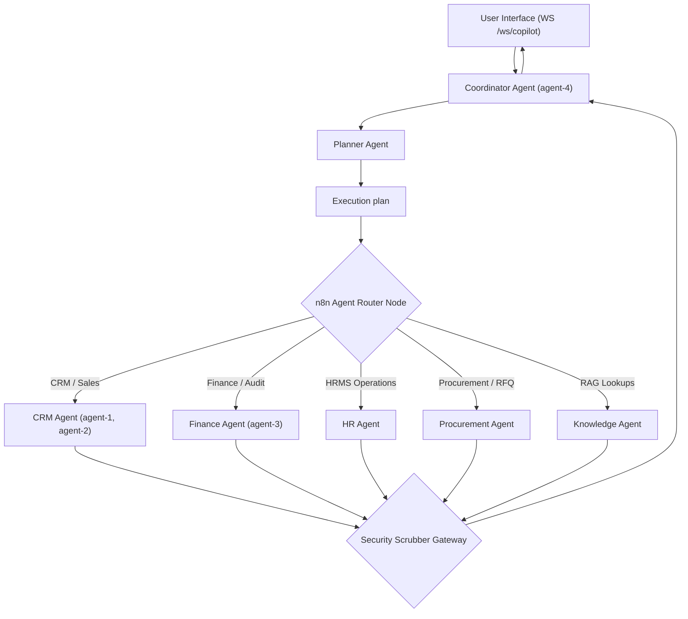

# Agent Orchestration & Coordination Specification
# Core Routing Protocols, State Delegation, and Hand-Off Thresholds

This document details the cognitive orchestration architecture and routing mechanics of the Sentinel ERP n8n Multi-Agent system. It establishes how individual agents exchange state information, how the Coordinator handles delegating sub-tasks, and how manual verification loops are managed.

---

## 1. Multi-Agent Orchestration Matrix
The Sentinel ERP n8n engine organizes agents into a structured hierarchical collaboration model:



---

## 2. Dynamic Planning & Execution Loop
When a request is intercepted:
1. **Intake:** The Coordinator ingests the user input message.
2. **Context Resolution:** The system queries database telemetry to determine current tenant scopes and active security profiles.
3. **Plan Formulation:** The Planner generates a sequential schema plan mapping needed variables and target agents.
4. **Execution Routing:** The n8n agent router maps the plan steps to sub-workflows.
5. **PII Interception:** Each agent's input is passed through the pre-flight Security Scrubber to strip out raw PII values.
6. **Result Synthesis:** Output results are gathered and consolidated by the Coordinator into a structured context before pushing back to the client WebSocket.

---

## 3. Delegation & Handoff Protocols

### Handoff Trigger Conditions
Agents delegate sub-tasks when:
* **Capability Boundaries:** The Finance Auditor detects invoice discrepancies requiring lead client adjustments, triggering a CRM qualification task.
* **Confidence Scores:** If an agent's confidence rating falls below `0.85`, it initiates a delegation request to the Coordinator to route the case to a human manager.
* **Cost Limits:** If an agent's input context size approaches token capacity limits, it requests summarization from the Analytics Agent prior to continuing.

### State Variable Mapping
When handoffs occur, state must be transferred as structured JSON objects:
```json
{
  "context_header": {
    "parent_run_id": "uuid-9208-1029",
    "originating_agent": "agent-1",
    "target_agent": "agent-2",
    "tenant_id": "tenant-default-01",
    "security_scope": "sales_ops"
  },
  "payload": {
    "deal_id": "deal-304",
    "client_name": "Acme Corp",
    "negotiation_metrics": {
      "discount_proposed": 18.5,
      "base_value": 450000.00
    }
  }
}
```

---

## 4. Human-In-The-Loop (HITL) Validation Paths
Sentinel ERP enforces mandatory validation breakpoints prior to executing high-risk database transactions:

| Target Action | Risk Level | Threshold | HITL Approval Mechanism |
| :--- | :--- | :--- | :--- |
| Ledger adjustment postings | Critical | $> ₹5,00,000$ | Triggers custom Slack interactive block block + holds n8n execution thread. |
| Sales Contract discounts | High | $> 15\%$ and $\le 25\%$ | Finance Manager manual token signature required. |
| Sales Contract discounts | Critical | $> 25\%$ | VP Sales confirmation required. |
| Employee Leaves approvals | Medium | Overlap in dept or $>10$ days | Direct alert to HR manager console with approve/reject API buttons. |

---

## 5. Fallback & Escalation Policies
* **Step Failures:** If an API endpoint times out (e.g. `/hr/employees` un-responding), the system retries 3 times with exponential backoff ($t_{backoff} = 2^{retry} \times 10$ seconds). If failure continues, n8n suspends the current run, records the state as `Suspended_HIPL`, and alerts the on-call administrator.
* **Routing Loops:** If the Coordinator detects an execution plan looping between the same two agents more than twice, it halts execution, alerts the user, and records the run status as `Failed`.
