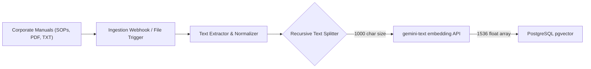

# RAG Retrieval & Semantic Indexing Architecture
# Vector Database Schema, Chunking Strategy, and Grounding Protocols

This document details the Retrieval-Augmented Generation (RAG) specification for grounding Sentinel ERP AI Agents using corporate policies, SOPs, and system manuals.

---

## 1. Document Ingestion Pipeline
The document ingestion process is automated via an n8n scheduled workflow (`rag-engine.json`):



---

## 2. Chunking & Splitting Strategy
To maintain semantic coherence, files are chunked according to these parameters:

* **Splitter Type:** Recursive Character Text Splitter (splits on paragraph, line break, space in sequence).
* **Target Chunk Size:** `1000` characters.
* **Chunk Overlap:** `200` characters. This prevents key rules or figures from being cut off at chunk boundaries.
* **Metadata Tagging:** Each chunk is stored with metadata headers mapping:
  - `doc_title`: Source filename.
  - `department`: Corporate ownership context (HR, Finance, Legal).
  - `checksum`: SHA-256 fingerprint of raw contents (prevents duplicate indexing).
  - `indexed_at`: Epoch timestamp.

---

## 3. Vector Database Schemas (pgvector)
Vector values are stored in the database schema:

```sql
CREATE TABLE vector_store.embeddings (
    embedding_id UUID PRIMARY KEY DEFAULT uuid_generate_v4(),
    doc_title VARCHAR(255) NOT NULL,
    chunk_content TEXT NOT NULL,
    embedding vector(1536) NOT NULL, -- 1536 dimensions matching gemini embeddings
    tags JSONB DEFAULT '[]'::jsonb,
    created_at TIMESTAMP WITH TIME ZONE DEFAULT CURRENT_TIMESTAMP
);
```

### Search Metrics
* **Similarity Metric:** Cosine Distance (`vector_cosine_ops`).
* **Indexing Method:** IVFFlat index with `lists = 100` to speed up queries.
* **Match Threshold:** Distance limit set at `< 0.40`. Matches exceeding this limit are discarded.

---

## 4. Context Grounding Template
When the Knowledge Retrieval Agent queries the database, matching chunks are injected into the downstream prompt using the template:

```markdown
You are provided with verified corporate context snippets below to answer the user query.
If the context snippets do not contain sufficient information to formulate an answer, state that you cannot find the answer and do not attempt to hallucinate facts.

---
RETIRETED CONTEXT CHUNKS:
[Source File: {{ doc_title }} | Chunk ID: {{ embedding_id }}]
{{ chunk_content }}
---

User Query: {{ user_query }}

Grounding Instructions:
- Answer the query using ONLY the details listed above.
- Cite the source files you used (e.g., "[Source: HR_Leave_Policy_2026.pdf]").
- Do not mention details not specifically validated in the context snippets.
```

---

## 5. Security & Multi-Tenant Isolation
* **Tenant Scopes:** When retrieving contexts, n8n queries must filter the tags query to match the requested `tenant_id` scope to prevent cross-tenant data leaks:
  `WHERE tags @> '{"tenant_id": "tenant-default-01"}'`
* **PII Redaction:** Before a chunk is stored or queried, its content is sent to the Security Scrubber to ensure no real credentials or PII fields are indexed inside the database.
